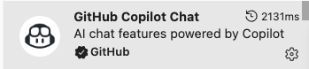
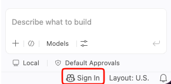
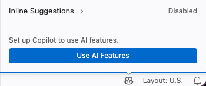
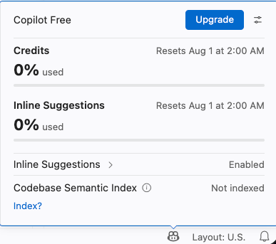
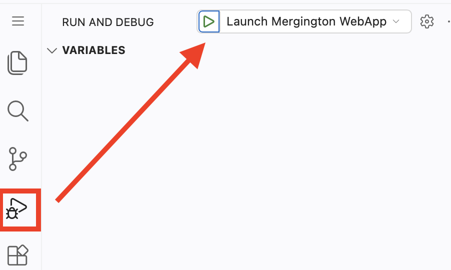

## Paso 1: Hola, Copilot

¡Bienvenido/a a tu ejercicio **"Primeros pasos con GitHub Copilot"**! :robot:

En este ejercicio, usarás distintas funciones de GitHub Copilot para trabajar en un sitio web que permite a los estudiantes de Mergington High School inscribirse en actividades extracurriculares. 🎻 ⚽️ ♟️


### 📖 Teoría: Conociendo GitHub Copilot


GitHub Copilot es un asistente de programación con IA que te ayuda a escribir código más rápido y con menos esfuerzo, permitiéndote enfocar más energía en resolver problemas y colaborar.

Se ha demostrado que GitHub Copilot aumenta la productividad de los desarrolladores y acelera el ritmo del desarrollo de software. Para más información, consulta el artículo del blog de GitHub [Research: quantifying GitHub Copilot's impact on developer productivity and happiness](https://github.blog/news-insights/research/research-quantifying-github-copilots-impact-on-developer-productivity-and-happiness/).

Mientras trabajas en tu IDE, lo más habitual es interactuar con GitHub Copilot de las siguientes formas:

| Modo de interacción        | 📝 Descripción                                                                                                                 | 🎯 Ideal para                                                                                                     |
| --------------------------- | ------------------------------------------------------------------------------------------------------------------------------ | ------------------------------------------------------------------------------------------------------------------ |
| **⚡ Inline suggestions**   | Sugerencias de código impulsadas por IA que aparecen mientras escribes, ofreciendo autocompletados con contexto, desde una línea hasta funciones enteras. | Completar la línea actual, a veces todo un bloque de código nuevo                                                  |
| **💭 Inline Chat**          | Chat interactivo acotado a tu archivo o selección actual. Permite hacer preguntas sobre bloques de código específicos.          | Explicaciones de código, depuración de funciones específicas, mejoras puntuales                                    |
| **💬 Ask Mode**              | Optimizado para responder preguntas sobre tu base de código, programación y conceptos tecnológicos generales.                  | Entender cómo funciona el código, hacer lluvia de ideas, resolver dudas                                             |
| **🤖 Agent Mode**            | Modo predeterminado recomendado para la mayoría de tareas de programación: ediciones autónomas, uso de herramientas y seguimiento hasta completar la tarea. | Tareas de programación del día a día, desde correcciones puntuales hasta trabajo de implementación en varios archivos |
| **🧭 Plan Agent**            | Optimizado para elaborar un plan y hacer preguntas de aclaración antes de realizar cualquier cambio en el código.               | Cuando quieres revisar un plan primero y luego pasar a la implementación                                            |

Mientras trabajas, notarás que GitHub Copilot puede ayudarte en varios lugares del sitio `github.com` y en tus entornos de programación favoritos, como VS Code, JetBrains y Xcode.

Para el código de hoy, practicaremos con VS Code en un entorno de desarrollo preconfigurado conocido como [GitHub Codespace](https://github.com/features/codespaces).

> [!TIP]
> Puedes conocer más sobre las funciones actuales y próximas en la documentación de [GitHub Copilot Features](https://docs.github.com/en/copilot/about-github-copilot/github-copilot-features).

### :keyboard: Actividad: Obtén una introducción al proyecto de Copilot Chat

Vamos a iniciar nuestro entorno de desarrollo, usar Copilot para aprender un poco sobre el proyecto y luego hacer una prueba rápida.

1. Usa el siguiente botón para abrir la página **Create Codespace** en una nueva pestaña. Usa la configuración predeterminada.

   [](https://codespaces.new/{{full_repo_name}}?quickstart=1)

1. Confirma que el campo **Repository** corresponde a tu copia del ejercicio, no al original, y luego haz clic en el botón verde **Create Codespace**.
   - ✅ Tu copia: `/{{full_repo_name}}`
   - ❌ Original: `/skills/getting-started-with-github-copilot`

1. Espera un momento a que Visual Studio Code cargue en tu navegador.
1. En la barra lateral izquierda, haz clic en la pestaña de extensiones y verifica que las extensiones `GitHub Copilot Chat` y `Python` estén instaladas y habilitadas.

   

   

   <details>
   <summary>🔎 ¿Falta la extensión de GitHub Copilot Chat? ❓</summary>

   Si la extensión de GitHub Copilot Chat no aparece, asegúrate de haber iniciado sesión en GitHub Copilot. Busca el ícono de **GitHub Copilot** en la parte inferior derecha de la ventana de VS Code.

   | Ícono de la barra de estado                                                                                             | Se requiere iniciar sesión                                                                                | Copilot activo                                                                                                  |
   | ----------------------------------------------------------------------------------------------------------------------- | -------------------------------------------------------------------------------------------------------- | --------------------------------------------------------------------------------------------------------------- |
   |  |  |  |

   A partir de aquí ya deberías poder continuar, incluso si la extensión aún no aparece en la pestaña de extensiones.

   </details>

1. En la parte superior de VS Code, ubica y haz clic en el ícono **Toggle Chat** para abrir un panel lateral de Copilot Chat.

   

   > 🪧 **Nota:** Si es la primera vez que usas GitHub Copilot, es posible que debas aceptar los términos de uso para continuar.


1. Asegúrate de estar en **Ask Mode** para nuestra primera interacción.

   

1. Ingresa el siguiente prompt para pedirle a Copilot que te presente el proyecto.

   > 
   >
   > ```prompt
   > Por favor, explica brevemente la estructura de este proyecto.
   > ¿Qué debo hacer para ejecutarlo?
   > ```

   > 🪧 **Nota:** No es necesario seguir las instrucciones recomendadas por Copilot. Ya hemos preparado el entorno por ti.

1. Ahora que sabemos un poco más sobre el proyecto, ¡intentemos ejecutarlo! En la barra lateral izquierda, selecciona la pestaña `Run and Debug` y luego presiona el ícono **Start Debugging**.

   

1. Queremos ver nuestra página web funcionando en un navegador, así que busquemos la url y el puerto. Si no es visible, expande el panel inferior y selecciona la pestaña **Ports**.

1. En la lista, busca el puerto `8000` y su enlace correspondiente. Pasa el cursor sobre el enlace y selecciona el ícono **Open in browser**.

   

### :keyboard: Actividad: Usa Copilot para recordar un comando de terminal 🙋

¡Buen trabajo! Ahora que estamos familiarizados con la aplicación y sabemos que funciona, pidámosle ayuda a Copilot para crear una rama y así poder personalizar el proyecto.

1. En el panel inferior de VS Code, selecciona la pestaña **Terminal** y en el lado derecho haz clic en el signo `+` para crear una nueva ventana de terminal.

   > 🪧 **Nota:** Esto evitará detener la sesión de depuración existente que está alojando nuestro servicio web.

1. Dentro de la nueva ventana de terminal, usa el atajo de teclado `Ctrl + I` (Windows) o `Cmd + I` (Mac) para abrir el **Inline Chat de la terminal de Copilot**.

1. Pidámosle a Copilot que nos ayude a recordar un comando que hemos olvidado: crear una rama y publicarla.

   > 
   >
   > ```prompt
   > Hola Copilot, ¿cómo puedo crear y publicar una nueva rama de Git llamada "accelerate-with-copilot"?
   > ```

   > 💡 **Consejo:** Si Copilot no te da exactamente lo que necesitas, siempre puedes seguir explicando lo que buscas. Copilot recordará el historial de la conversación para las respuestas de seguimiento.

1. Presiona el botón `Run` para que Copilot inserte el comando de terminal por nosotros. ¡No hace falta copiar y pegar!

1. Después de un momento, mira en la parte inferior izquierda de la barra de estado de VS Code para ver la rama activa. Ahora debería decir `accelerate-with-copilot`. Si es así, ¡ya terminaste este paso!

1. Ahora que tu rama está publicada en GitHub, Mona debería estar revisando tu trabajo. Dale un momento y mantente atento/a a los comentarios. Verás que responde con información de progreso y la siguiente lección.

<details>
<summary>¿Tienes problemas? 🤷</summary><br/>

Si no recibes retroalimentación, aquí hay algunas cosas para revisar:

- Asegúrate de haber creado la rama con el nombre exacto `accelerate-with-copilot`. Sin prefijos ni sufijos.
- Asegúrate de que la rama efectivamente se haya publicado en tu repositorio.

</details>
