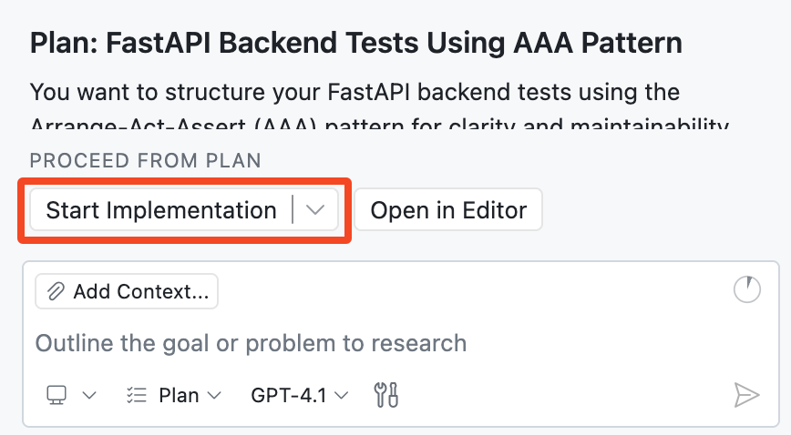

## Paso 4: Planifica tu implementación con el Planning Agent 🧭

En el paso anterior, Agent Mode nos ayudó a avanzar rápido y lanzar nueva funcionalidad. 🚀

Ahora bajemos el ritmo por una ronda y trabajemos como arquitectos: primero definamos un buen enfoque de pruebas y luego lo entregamos para su implementación. Esto nos da mayor claridad, menos sorpresas y resultados más limpios. 🧪

### 📖 Teoría: ¿Qué es Copilot Plan Agent?

El [Plan Agent](https://code.visualstudio.com/docs/copilot/agents/planning) de Copilot te ayuda a diseñar una solución antes de que se modifique cualquier código.

En lugar de saltar directamente a las ediciones, investiga tu solicitud, hace preguntas de aclaración y elabora un plan de implementación que puedes refinar.

#### Plan Agent (de un vistazo)

| Aspecto | 🧭 Plan Agent |
| --- | --- |
| Propósito | Crea un plan de implementación estructurado antes de que comience la programación. |
| Recolección de contexto | Usa investigación de solo lectura para entender los requisitos y las restricciones. |
| Estilo de colaboración | Hace preguntas de aclaración y luego actualiza el plan usando tus respuestas. |
| Iteración | Permite varias rondas de refinamiento antes de la implementación. |
| Seguridad | No edita archivos hasta que apruebes el plan y lo entregues a **Agent Mode**. |
| Entrega | El botón **Start implementation** entrega el plan aprobado a **Agent Mode** para la programación. |

> [!TIP]
> Puedes comenzar con una solicitud de alto nivel y luego agregar restricciones y detalles en prompts de seguimiento.

### ⌨️ Actividad: Planifica e implementa pruebas del backend

Tu backend todavía no tiene ninguna cobertura de pruebas. Usa **Plan Agent** para crear un plan, responder preguntas y luego lanzar la implementación.

1. Abre el panel de **Copilot Chat** y cambia a **Plan Agent**.

   


1. Comencemos con un prompt amplio y Copilot nos ayudará a completar los detalles:

   > 
   >
   > ```prompt
   > Quiero agregar pruebas de backend con FastAPI en un directorio de pruebas separado.
   > ```

1. Espera a que Copilot genere su primer plan. Si te hace alguna pregunta, respóndela lo mejor que puedas.

   > 🪧 **Nota:** No te preocupes por que quede perfecto, siempre puedes refinar el plan más adelante.

1. Puedes refinar el plan y dar detalles adicionales en prompts de seguimiento.

   Aquí tienes algunos ejemplos:

   > 
   >
   > ```prompt
   > Usemos el patrón de pruebas AAA (Arrange-Act-Assert) para estructurar nuestras pruebas
   > ```

   > 
   >
   > ```prompt
   > Asegúrate de que usemos `pytest` y agrégalo al archivo `requirements.txt`
   > ```


1. Revisa el plan propuesto y, cuando estés conforme con él, haz clic en **Start implementation** para entregarlo a **Agent Mode**.

   

   Nota cómo al hacer clic en el botón se cambió de **Plan** a **Agent Mode**. A partir de este punto, Copilot puede editar tu base de código, igual que antes.

1. Observa cómo Copilot implementa el plan que acabas de crear. Puede que te pida permisos para ejecutar ciertas herramientas (por ejemplo, ejecutar comandos o crear entornos virtuales). Aprueba estos permisos para que pueda seguir trabajando.

1. Revisa los cambios y asegúrate de que las pruebas se ejecuten correctamente. Si es necesario, continúa guiando a Copilot hasta que la implementación esté completa.

   **🎯 Objetivo: Logra que todas las pruebas pasen (en verde) antes de continuar. ✅**

   > 🪧 **Nota:** Agent Mode puede completar esto en una sola pasada, o puede necesitar prompts de seguimiento de tu parte.

1. Haz **commit** y **push** de todos tus cambios a la rama `accelerate-with-copilot`.

1. Espera a que Mona revise tu trabajo y comparta el siguiente paso.

<details>
<summary>¿Tienes problemas? 🤷</summary><br/>

- Si las pruebas no se ejecutaron, pídele a Copilot que las ejecute por ti.
- Asegúrate de que `pytest` esté agregado en `requirements.txt` y de que exista un directorio `tests/`.

</details>
